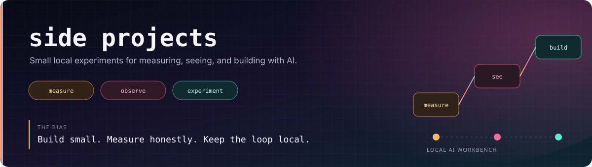

  
  
  

# side-projects

A collection of focused experiments for understanding, evaluating, and building with
small language models on ordinary hardware.

These projects are deliberately narrow. Each one starts with a concrete question, builds
the smallest useful instrument, and documents what the evidence does and does not show.

---

## Project map

| Project | Status | Question or role |
|---|---|---|
| [`neural-observatory`](neural-observatory/) | Available | What is happening inside a small transformer while it generates? |
| [`slm-evaluation-suite`](slm-evaluation-suite/) | Next | How can local model performance be measured without pretending one number explains quality? |
| `vocabulary-geometry-lab` | Planned | How does a model move through output-vocabulary space before a prediction stabilises? |

---

## Neural Observatory

[`neural-observatory`](neural-observatory/) is an interactive CPU visualiser for a small
language model. It captures layer-wise activations and generation telemetry and exposes
them through views such as:

- Logit lens predictions across layers.
- Attention-head entropy and focus.
- MLP sparsity and residual-stream norms.
- Token probability and entropy timelines.
- KV-cache and memory telemetry.
- A data-driven three-dimensional transformer stack.

Its purpose is observability, not speed. For a fast local runtime, see
[`llm-local-harness`](https://github.com/divyamtewary/development/tree/main/llm-local-harness).

---

## What comes next

`slm-evaluation-suite` will turn the measurement work into a reproducible, headless
evaluation package with explicit separation between measured, derived, and interpreted
results.

The next research artifact, `vocabulary-geometry-lab`, will connect the observatory's
layer-wise traces with the information-geometric ideas developed in the
[`research`](https://github.com/divyamtewary/research) repository.

---

## Working principles

- Prefer local, inspectable tools over opaque hosted demos.
- Use small models so experiments can be repeated.
- Keep raw measurements separate from interpretations.
- Show failures and regressions, not only successful outputs.
- Build an interactive view only when it reveals structure clearly.
- State limitations beside the result they qualify.

---

## Related repositories

- [`research`](https://github.com/divyamtewary/research) - mathematical notes and research visualisers.
- [`development`](https://github.com/divyamtewary/development) - runtimes, tools, and agent systems.
- [`blog`](https://github.com/divyamtewary/blog) - public writing about the work and the lessons behind it.

---

## Author

Divyam Tewary is building practical AI systems, exploring how intelligence works, and
turning difficult ideas into interactive tools.
