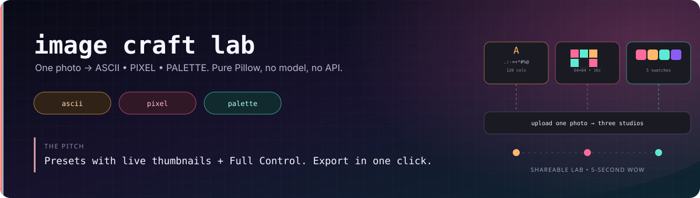
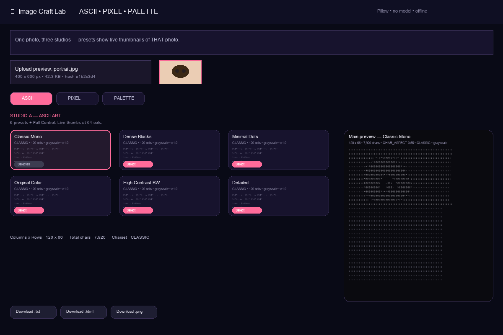
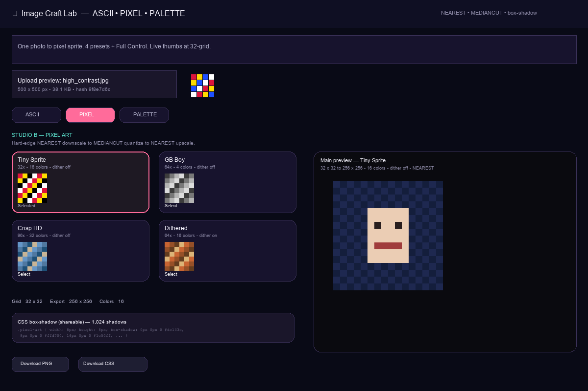
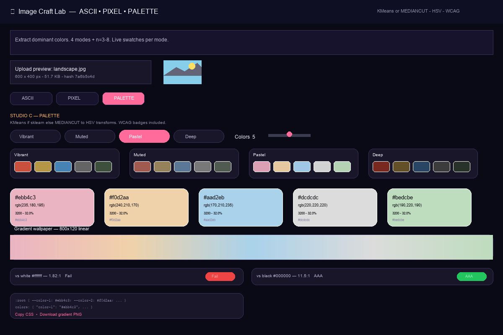

<p align="center">
  
  
  
  
  
</p>

# Image Craft Lab

**One photo, three transformations — ASCII, Pixel, Palette. The most shareable lab in the repo.**

Beginners see results in 5 seconds (upload → pick preset → download). Intermediates get Full Control (charset/cols/contrast, grid/colors/dither, HSV modes). Pure Pillow — no model, no API, no GPU, works offline after `pip install`. Merges the three photo-upload ideas into one polished lab.

> Upload **one** photo. Three studios share it: **ASCII** (text) • **PIXEL** (sprite) • **PALETTE** (colors). Each has presets with **live thumbnails on that photo** + Full Control mode.

---

## Screenshots

| ASCII — 6 presets, live 64-col thumbs | PIXEL — 4 presets, live 32-grid thumbs |
|---|---|
|  |  |

| PALETTE — 4 modes + n=3–8, swatches + gradient + WCAG |
|---|
|  |

*Screenshots are from the live app with synthetic samples (`assets/samples/`). Same image feeds all three tabs — switch without re-uploading.*

---

## The three studios

| Studio | What it does | Presets | Full Control | Exports |
|---|---|---|---|---|
| **ASCII** (`src/ascii.py`) | Luminance → `charset[int(p/255*(n-1))]` with aspect-correct `0.55` and `BILINEAR` color sampling. `original` adds per-char `<span color>`. | 6: Classic Mono, Dense Blocks, Minimal Dots, Original Color, High Contrast BW, Detailed | charset / cols 40–300 / color_mode `original/grayscale/bw` / contrast 0.5–2.0 / brightness 0.5–2.0 / invert | `.txt` • `.html` (spans or `<pre>`) • `.png` (PIL-rendered) |
| **PIXEL** (`src/pixel.py`) | `NEAREST` downscale to `grid × grid·h/w` → `quantize(MEDIANCUT, dither)` → `NEAREST` upscale × `scale`. | 4: Tiny Sprite `32×16` · GB Boy `64×4` · Crisp HD `96×32` · Dithered `64×16+dither` | grid `16/32/64/96/128` · colors `4/8/16/32/64` · dither toggle · scale `4–16` | `PNG` (scaled) • `PNG` (small grid) • `CSS` `box-shadow` |
| **PALETTE** (`src/palette.py`) | Resize 100×100 `BILINEAR` → `KMeans(n_init=5, random_state=0)` or `MEDIANCUT` fallback → sort dominant → HSV mode transforms → `css_vars` + 800×120 gradient + WCAG | 4 modes: Vibrant / Muted `s×0.6` / Pastel `s×0.5 v+0.25` / Deep `v×0.7` | `n_colors` 3–8 slider (mode is the preset) | `CSS` (`:root` + Tailwind) • `PNG` gradient |

Algorithm details: `docs/ALGORITHM.md` — luminance formulas, `CHAR_ASPECT=0.55`, `NEAREST` vs `BILINEAR`, KMeans vs MEDIANCUT, HSV math, WCAG ` (L+0.05)/(L+0.05)` and why `0.55` matters more than charset choice.

---

## Quick start — 60 seconds

```bash
git clone https://github.com/divyamtewary/side-projects.git
cd side-projects/image-craft-lab
python -m venv .venv
# Windows
.venv\Scripts\activate
# macOS / Linux
# source .venv/bin/activate

pip install -r requirements.txt   # scikit-learn optional; without it palette uses MEDIANCUT
streamlit run app.py
# open http://localhost:8501
# Upload photo → ASCII tab → click preset card → Download .txt
# Switch to PIXEL → Tiny Sprite → Download PNG
# Switch to PALETTE → Pastel → Copy CSS
```

No weights, no token, no GPU. Works offline after install.

### Requirements

- Python 3.10+
- `Pillow>=10.0` (hard dep)
- `numpy>=1.26`
- `streamlit>=1.36`
- `scikit-learn>=1.3` **optional** — if missing, palette falls back to `PIL.Image.MEDIANCUT` (documented both paths; visuals are close on natural photos).

`requirements.txt` lists `scikit-learn` but palette works without it.

---

## Usage guide

### Step 1 — Upload (shared)

- **Upload** — `st.file_uploader(["png","jpg","jpeg","webp"], max 10MB)` in the top row. Drag or browse; the original thumbnail, filename, dimensions, size and `image_bytes_hash[:8]` appear below.
- **Or try a sample** — `assets/samples/` has 3 synthetic images (Pillow-generated, no licences): **Portrait** `400×600`, **Landscape** `600×400`, **High Contrast** `500×500` (checker + red/yellow/blue). Click **Use sample** — demo works without upload. Samples are illustrated, not photos.
- **Shared** — `image_bytes_hash` is the `@st.cache_data` key. All three studios read the same `PIL.Image`; switch tabs without re-uploading.

### Step 2 — ASCII tab

1. **Preset cards — 2×3 grid (6 presets)** at top. Each card shows a **live 64-col thumbnail** of *the currently uploaded image* (cached on `(hash, charset, cols, color, contrast, brightness, invert)`):
   - **Classic Mono** `CLASSIC 120 grayscale c1.0` — balanced default
   - **Dense Blocks** `BLOCKS 100 grayscale c1.2` — posterized `█▓▒░`
   - **Minimal Dots** `MINIMAL 140 grayscale c1.0` — `.:-=+*#%@` inverse ramp
   - **Original Color** `CLASSIC 120 original c1.0` — per-char color spans
   - **High Contrast BW** `BW 100 bw c1.5` — threshold `128` → `█` / ` `
   - **Detailed** `DETAILED 180 grayscale c1.0` — 70-char photo-real
2. Click **Select** on any card → main preview updates instantly; its params sync to Full Control sliders.
3. **Full Control** — check the box to override: `cols` 40–300, `charset` dropdown (`CLASSIC/BLOCKS/MINIMAL/DETAILED/BW`), `color_mode` radio, `contrast/brightness` 0.5–2.0 sliders, `invert` toggle. Live-updates.
4. **Main preview** — monospace `<pre>` (grayscale/bw) or `<div>` with `<span color>` (original). Stats below: `cols×rows • chars • CHAR_ASPECT 0.55`.
5. **Export** — **Download .txt** (plain), **Download .html** (spans preserved), **Download .png** (PIL `DejaVuSansMono` render). Also *Copy text / html* expander.

**Tip:** Aspect is `rows = int(cols * (h/w) * 0.55)` — `cols` controls detail; `0.55` fixes the monospace tall-cell stretch. Try `Detailed` at `cols=180` on a high-res portrait.

### Step 3 — PIXEL tab

1. **Preset cards — 2×2 grid (4 presets)** with **live 32-grid thumbnails**:
   - **Tiny Sprite** `32×16 off` — `32×32` retro
   - **GB Boy** `64×4 off` — 4-color Game Boy
   - **Crisp HD** `96×32 off` — detailed
   - **Dithered** `64×16 on` — Floyd-Steinberg via Pillow
2. Click **Select** → main preview syncs.
3. **Full Control** — `grid` `16/32/64/96/128`, `colors` `4/8/16/32/64`, `dither` toggle, `scale` `4–16`.
4. **Main preview** — upscaled with `NEAREST × scale` (crisp blocks). Stats: `small_w×small_h → width×height • colors • dither`.
5. **CSS** — expander shows `box-shadow: 2px 2px 0 #hex, ...` — paste a single `<div class="pixel-art">` for a codepen without an image. **Download CSS** + **Download PNG** (scaled) / **small PNG** (grid).

Palette keeps the `scale` aesthetic — the logical `small` is the art, the `large` is the display.

### Step 4 — PALETTE tab

1. **Mode pills** — `Vibrant` (no change) · `Muted` `s×0.6` · `Pastel` `s×0.5 v+0.25` · `Deep` `v×0.7`. Horizontal radio; **live thumbnails row** below shows 4 mini 5-swatch previews (one per mode) for the uploaded image.
2. **n_colors slider** — `3–8` (Full Control). Main palette re-computes on change (KMeans with `n_init=5, random_state=0` or `MEDIANCUT` fallback).
3. **Swatches** — dominant-first (sorted by `counts` descending). Each shows `hex` + `rgb(r,g,b)` + copy chip + `counts • %`. Background is the color; text flips white/black via luma.
4. **Gradient** — `800×120` linear `lerp` between sorted hexes; **Download gradient PNG** (wallpaper-ready).
5. **WCAG** — badges for dominant vs `white` and vs `black`: `contrast_ratio = (L_lighter+0.05)/(L_darker+0.05)` with `L = 0.2126R_s +0.7152G_s+0.0722B_s`. Thresholds: `≥7 AAA` · `≥4.5 AA` · `≥3 AA Large` · else `Fail`. Shows pass/fail inline.
6. **CSS** — `st.code(css_vars)` with native copy + **Download CSS** (`:root { --color-1: #hex; }` + Tailwind `colors: {}` snippet).

Switching `n_colors` or `mode` is instant (cached per `(hash, n, mode)`).

### Caching

`@st.cache_data` per engine keyed on `(image_bytes_hash, all_params)`. Same image + same preset → instant when switching tabs. Thumbnails use cheap params (`64-col`/`32-grid`/`5-swatch`) so the card grid stays snappy.

---

## Export formats

| Studio | File | What you get |
|---|---|---|
| ASCII | `ascii.txt` | Plain `cols×rows` text with `\n` |
| ASCII | `ascii.html` | `grayscale/bw` → `<pre>`; `original` → `<div>` with `<span style="color:rgb(r,g,b)">` + `<br>` |
| ASCII | `ascii.png` | PIL render of `text` with `DejaVuSansMono` (fallback `load_default`), `bg #0a0a0f` |
| PIXEL | `pixel.png` | Upscaled `small_w*scale × small_h*scale` RGB, `NEAREST` |
| PIXEL | `pixel_small.png` | Quantized `small_w×small_h` (logical art) |
| PIXEL | `pixel.css` | `.pixel-art { width: 8px; height: 8px; box-shadow: ... }` |
| PALETTE | `palette.css` | `:root { --color-1: #hex; ... }` + Tailwind `colors: { "color-1": "#hex", ... }` |
| PALETTE | `gradient.png` | `800×120` linear gradient PNG |

---

## Project structure

```
image-craft-lab/
├── app.py                # single Streamlit app (~500 lines) — 3 tabs, live thumbnails, exports
├── src/
│   ├── __init__.py
│   ├── ascii.py          # image_to_ascii
│   ├── pixel.py          # image_to_pixel
│   ├── palette.py        # extract_palette + WCAG
│   └── presets.py        # CHARSET_* + ASCII/Pixel/Palette presets
├── assets/samples/
│   ├── portrait.jpg      # synthetic 400×600 (Pillow)
│   ├── landscape.jpg     # synthetic 600×400
│   └── high_contrast.jpg # synthetic 500×500
├── docs/
│   ├── ALGORITHM.md      # luminance, 0.55, NEAREST, KMeans vs MEDIANCUT, HSV, WCAG
│   └── img/
│       ├── banner.svg
│       ├── 01-ascii.png
│       ├── 02-pixel.png
│       └── 03-palette.png
├── tests/test_craft.py   # 18 tests, pytest -q green
├── requirements.txt
├── LICENSE (MIT)
└── PROJECT_BRIEF.md
```

---

## Tests

```bash
pip install -r requirements.txt
pytest -q
# 18 passed — black→first char, white→last, cols clamp, bw 2-char, invert swaps,
#            pixel size/grid×scaled, colors ≤ requested, dither no-crash,
#            palette len/hex/counted sum, vibrant vs pastel differ, WCAG, gradient 800×120,
#            missing-sklearn fallback → still n_colors
```

No UI in tests — generated images only.

---

## Troubleshooting

| Symptom | Fix |
|---|---|
| `No module named 'PIL'` | `pip install -r requirements.txt` — Pillow is the only hard dep |
| `No module named 'sklearn'` | Optional. Palette falls back to `MEDIANCUT`; visuals are close. Install with `pip install scikit-learn` for KMeans |
| `File too large — max 10 MB` | Compress or resize before upload; the uploader enforces 10 MB |
| Colors look washed | Palette `Pastel` is intentionally `s×0.5 v+0.25`; switch to `Vibrant` for original saturation |
| ASCII looks stretched | That's `CHAR_ASPECT=0.55` correcting tall monospace cells. Try `cols=80` instead of `180` |
| Pixel CSS huge | `128×128` → ~16k shadows (~400 KB). Use `32` or `64` grid for shareables |
| `streamlit: command not found` | Activate venv: `.\.venv\Scripts\activate` (Windows) or `source .venv/bin/activate` (macOS/Linux) |

---

## Roadmap

- Pixel hand-paint editor + onion skin
- ASCII edge mode (Canny) + video
- Palette ASE / Coolors export + palette-from-palette (harmony rules)
- CLI: `python -m src.ascii input.jpg --preset classic --cols 120 > out.txt`

---

## Related

- [`neural-observatory`](../neural-observatory/) — what happens *inside* a small transformer while it generates
- [`slm-evaluation-suite`](../slm-evaluation-suite/) — measure local model performance (Tkinter)
- [`side-projects` root](../README.md) — map: measure → observe → experiment

---

## License

MIT — see `LICENSE`.

---

*Build small. Measure honestly. Keep the loop local.*
