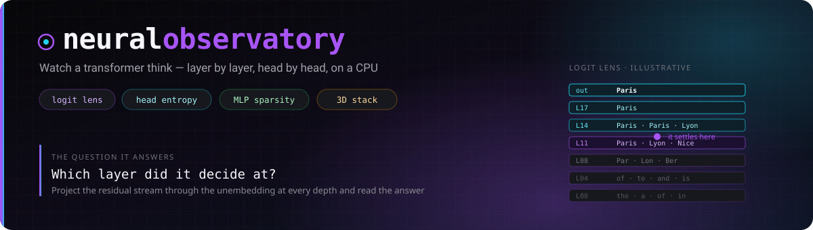
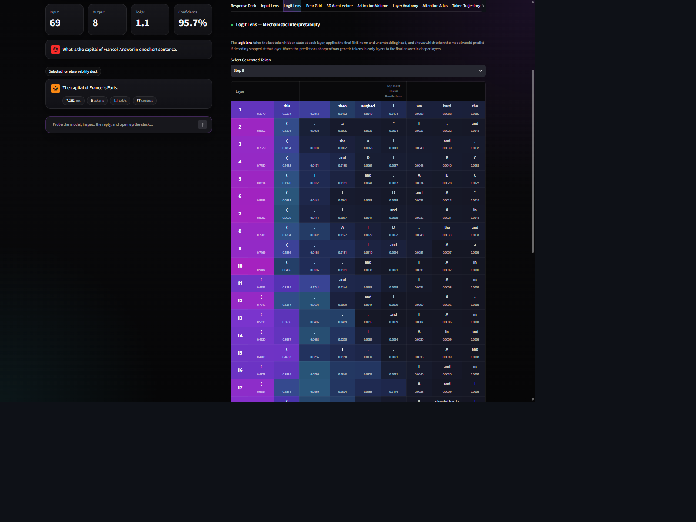
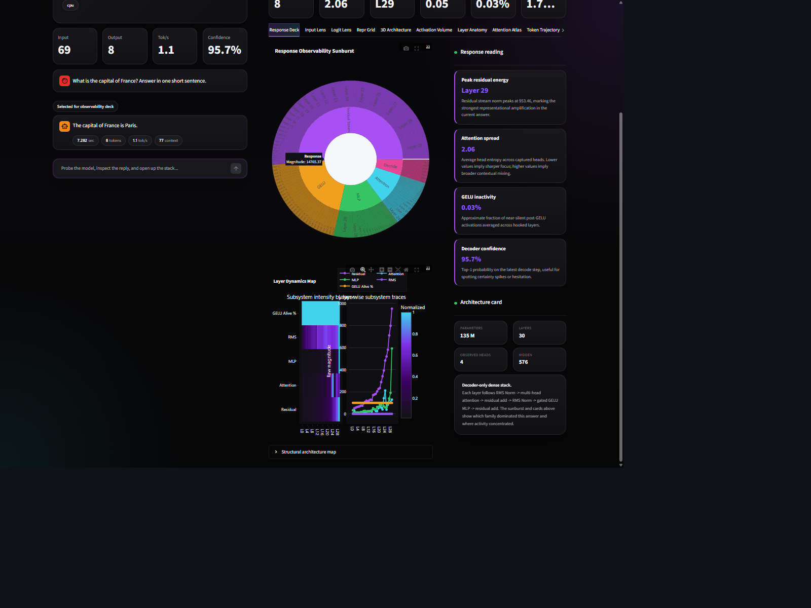

<p align="center">
  
  
  
  
</p>

# Neural Observatory

An interactive visualiser that instruments a small language model while it generates,
and shows you what happened inside — per-layer activations, attention-head entropy, MLP
sparsity, RMS-norm scale factors, and a **logit lens** that reveals which layer the model
actually made up its mind at.

Everything runs locally on CPU with a 135M-parameter model. No GPU, no API key, no HF
account, no cloud.

```bash
pip install -r requirements.txt
streamlit run app.py
```

That is the whole setup. Weights are pulled from the Hub on first run and cached.

---

## The one chart worth the install

**Logit Lens.** At every layer, the residual stream is projected through the model's own
final norm and unembedding matrix, then decoded to tokens. You get the model's
"current best guess" at each depth for the same position.

Two things fall out of it immediately:

- The prediction is often **settled well before the last layer**. The remaining layers
  are refining confidence, not choosing a different answer.
- The shift from *"what is the last input token"* to *"what is the first output token"*
  is not gradual — it happens over a small band of layers, and you can see exactly where.

Nobody's benchmark number tells you that. A picture of it does.

---

## What you get

Eleven views over a single generation:

| Tab | What it shows |
|---|---|
| **Response Deck** | The generated text with live token-by-token telemetry |
| **Input Lens** | Per-token attention on the prompt, Q/K/V magnitudes, embedding norms, cross-layer attention for one selected token |
| **Logit Lens** | Layer-by-layer top-*k* predictions with probabilities |
| **Repr Grid** | The hidden-state vector laid out as an image, per layer and per step |
| **3D Architecture** | The whole stack in 3D, block opacity driven by measured activation norms |
| **Activation Volume** | Last-token activations as a voxel cloud through the layer stack |
| **Layer Anatomy** | Residual norms, RMS-norm scale, attention-vs-MLP contribution, sparsity |
| **Attention Atlas** | Head-entropy heatmap, per-head focus patterns, layer radar |
| **Token Trajectory** | Per-token probability, entropy timeline, candidate sunburst |
| **Memory & Trace** | KV-cache estimate, RSS, timing breakdown |
| **Experiment Bench** | Sweep settings and compare runs |

All of it comes from forward hooks on the live model, not from a saved trace.

---

## Model support

Any Hugging Face causal LM with a standard decoder stack. Pick one in the sidebar or set
`MODEL_ID`:

```bash
MODEL_ID=Qwen/Qwen2.5-0.5B-Instruct streamlit run app.py
```

| Model | Params | Gated? | Notes |
|---|---|---|---|
| `HuggingFaceTB/SmolLM2-135M-Instruct` | 135 M | No | **Default.** ~270 MB, ungated, runs on anything |
| `google/gemma-3-270m-it` | 270 M | **Yes** | Smallest Gemma. Needs a licence click + token |
| `Qwen/Qwen2.5-0.5B-Instruct` | 500 M | No | More layers to look at |
| `google/gemma-3-1b-it` | 1 B | **Yes** | Slow on CPU but the prettiest 3D stack |

> **Gated models.** Every `google/gemma-*` repo requires accepting the Gemma licence on
> its model page, then `huggingface-cli login` with a read token. The default is ungated
> precisely so you don't have to — the app reads all its dimensions from `model.config`,
> so nothing is hardcoded to one architecture and every model above renders identically.

Layout-dependent charts (representation grid, activation volume) factor the hidden
dimension at runtime rather than assuming a size, so a 576-dim model and a 1152-dim model
both render correctly.

---

## How the instrumentation works

Forward hooks are registered on every decoder layer's sub-modules — attention,
MLP, both norms — and capture activations on each generation step.

Two constraints are worth knowing, because they are the price of seeing anything:

1. **`attn_implementation="eager"` is mandatory.** SDPA and flash-attention never
   materialise the attention matrix; they compute the output without ever forming it. If
   you want per-head attention weights, you have to ask for the slow path.
2. **Hooks cost memory and time.** Every captured tensor is detached and moved to CPU, and
   there are a lot of them. This is a microscope, not an engine — if you want the same
   model *fast*, see [llm-local-harness](https://github.com/divyamtewary/development/tree/main/llm-local-harness).

---

## Screenshots

Both captured live on CPU with `HuggingFaceTB/SmolLM2-135M-Instruct`, answering *"What is the capital of France?"*

| | |
|---|---|
|  |  |
| **Logit Lens** — the prediction per layer, colour-coded by probability. Layer 1 guesses `this`; by layer 11 the model has committed. | **Response Deck** — the sunburst apportions this answer across residual, attention, MLP, norm and decode, next to the layer dynamics map. |

---

## Caveats

- **The logit lens is an approximation.** Projecting an intermediate residual stream
  through the final unembedding assumes the representation is already in the output basis.
  It is a useful lie, not a measurement. Treat the trend as real and the exact
  probabilities as indicative.
- **Attention weights are not explanations.** High attention to a token means the value
  vector was weighted heavily at that position. It does not mean the model "used" it in any
  causal sense.
- **Everything is single-sequence, greedy-friendly.** Batched or heavily sampled
  generation is not instrumented.
- **Dead-neuron and sparsity figures are threshold-dependent.** The threshold is fixed;
  changing it changes the story.

---

## Roadmap

- [ ] Attention-head ablation from the UI
- [ ] Export a run as a self-contained HTML report
- [ ] Side-by-side comparison of two models on the same prompt
- [ ] Tuned-lens style calibration instead of a raw logit lens

---

## Related

Part of a series on running and understanding small language models on ordinary hardware:

- [llm-local-harness](https://github.com/divyamtewary/development/tree/main/llm-local-harness) — the same models, made fast
- [slm-evaluation-suite](https://github.com/divyamtewary/side-projects) — the same models, measured

---

## License

MIT — see [LICENSE](LICENSE). Model weights are governed by their own licences.
