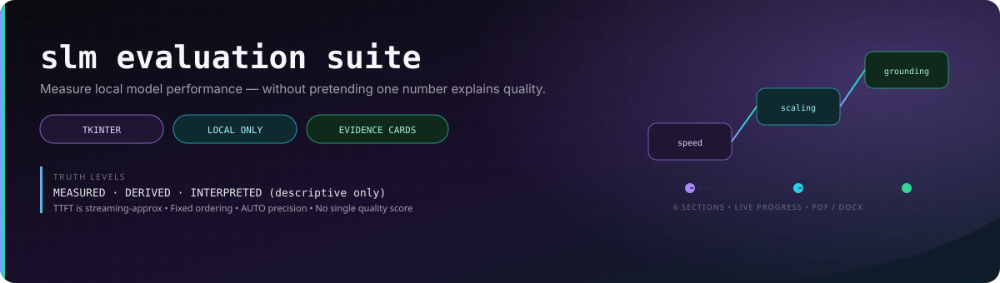
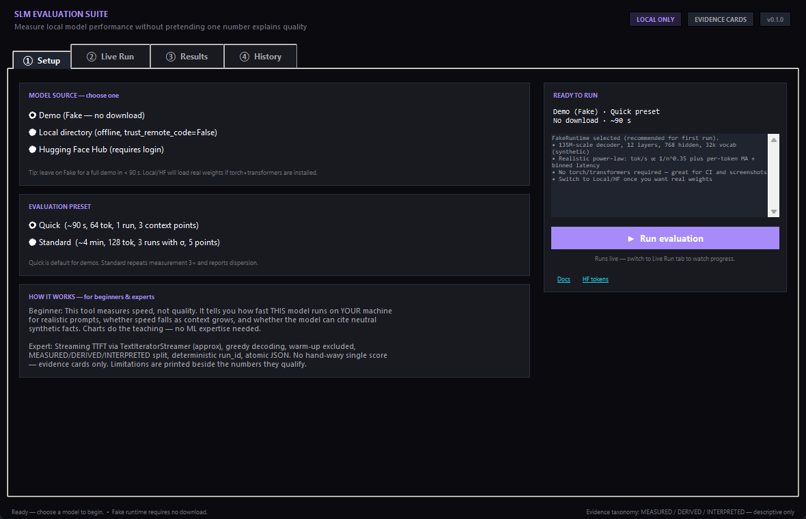
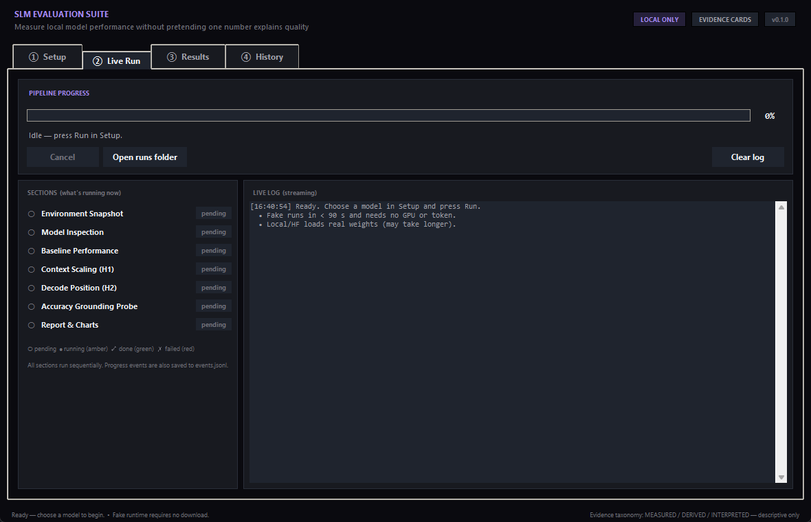
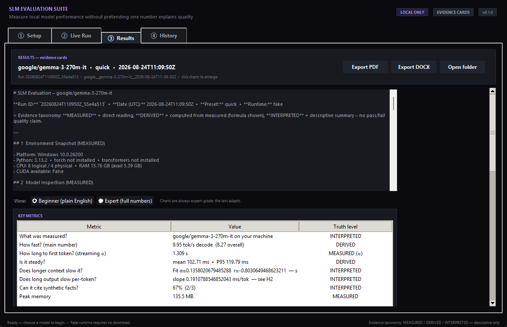
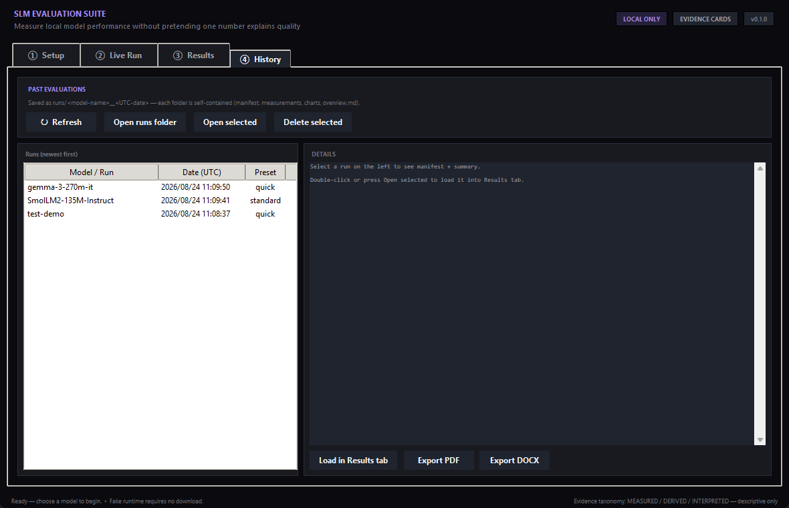
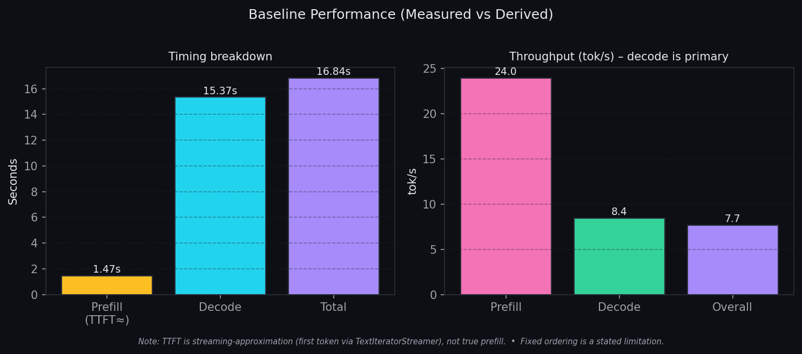
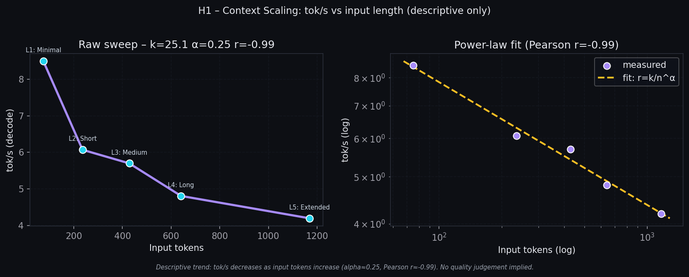
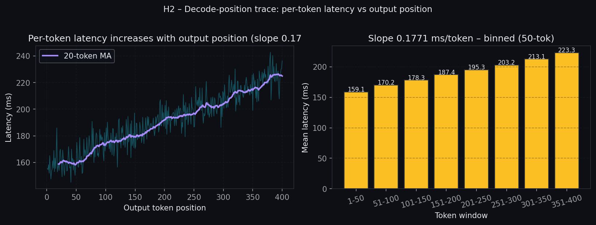
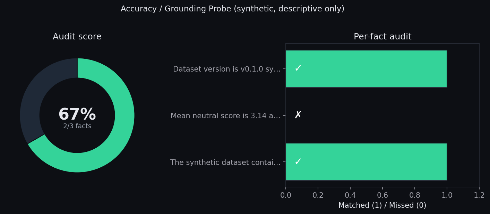

<p align="center">
  
  
  
  
  
</p>

# SLM Evaluation Suite — Tkinter Edition

**Measure local model performance without pretending one number explains quality.**

A self-hosted desktop tool for evaluating small language models on your own hardware. Choose a local directory **or** a Hugging Face model (after `huggingface-cli login`), watch the 6-section pipeline run live, then browse deterministic charts, metric tables and plain-English summaries — and export a PDF or DOCX for sharing. Past evaluations are saved as `runs/<model>__<UTC-date>` so beginners can compare and experts can audit.

> This is the Tkinter self-hosted build (your requested scope). It was descoped from the original headless `v0.1.0` playbook on purpose: the UI **is** the release.

---

## Screenshots

| Setup — pick a model | Live run — what's happening now |
|---|---|
|  |  |

| Results — charts + evidence cards | History — past runs |
|---|---|
|  |  |

<details>
<summary>Example charts generated from a run (SmolLM2-135M, standard preset, fake runtime)</summary>


*Baseline timing (left) and throughput (right). Decode tok/s is the primary metric.*


*H1: tok/s vs input length. Right panel is the log–log power-law fit `r = k / n^α`.*


*H2: per-token latency vs output position (left = raw trace + 20-token MA, right = 50-token binned means).*


*Grounding probe on synthetic neutral facts (labelled synthetic — no aviation fixtures).*

</details>

---

## What it measures (6 sections, always in this order)

1. **Environment snapshot** — platform, Python, CPU/RAM, torch/transformers versions, CUDA flag (MEASURED).
2. **Model inspection** — allowlisted `config.json` fields, architecture, layers/heads/hidden, vocab, file inventory — local dirs only, `trust_remote_code=False` (MEASURED).
3. **Baseline performance** — warm-up excluded, greedy decoding, fixed neutral prompt. Budget: quick `64` tok / 1 run, standard `128` tok / 3 runs with σ. Metrics: load time, TTFT (≈ via streaming), decode tok/s, overall tok/s, mean/median/P95/P99 latency, peak RSS (MEASURED + DERIVED).
4. **Context scaling (H1)** — fixed output budget, 3 (quick) or 5 (standard) synthetic neutral passages (75→1169 tokens). Power-law fit `r = k / n^α` and Pearson r (DERIVED). Conclusion is **descriptive only**.
5. **Decode-position (H2)** — long generation (200/400 tok) trace, binned 50-tok means, linear slope `ms/tok` (DERIVED).
6. **Accuracy / grounding probe** — synthetic neutral facts (`42 reference samples`, `mean 3.14`, `v0.1.0 synthetic`) with substring/keyword `audit_accuracy` (MEASURED + INTERPRETED).

Reporting then writes 5 deterministic `matplotlib` (Agg) PNGs, `overview.md`, `summary.json`, `hypotheses/H001.md`, `events.jsonl` and the `charts/` folder.

**Truth model:** `MEASURED` = direct reading, `DERIVED` = formula shown (e.g. `tok/s = tokens / seconds`), `INTERPRETED` = plain-English, descriptive-only summary. Limitations are printed **next to the numbers they qualify** (TTFT is streaming-approx, fixed ordering, AUTO precision).

> Why no single quality score? One number lies. Evidence cards replace it.

---

## Quick demo — 60 seconds, no download

You can tour the whole UI without any model weights:

```bash
git clone https://github.com/divyamtewary/side-projects.git
cd side-projects/slm-evaluation-suite
pip install -r requirements.txt   # FakeRuntime needs nothing else
python app.py
# In the app: leave Setup on "Demo (Fake — no download)" → Quick → ▶ Run evaluation
# Switch to Live Run to watch, then Results for charts. Exports work even for fake runs.
```

FakeRuntime simulates a 135 M-scale decoder with a realistic `r ∝ 1/n^0.35` slowdown so screenshots and PDFs are meaningful even before you install `torch`.

---

## Installation — from download to first real evaluation

### 1. Prerequisites

- **Python 3.10+** (3.13 tested on Windows here) and `pip`
- **8 GB RAM** recommended for 135 M–1 B models on CPU
- No GPU, no API key needed for fake/local runs; HF gated models need a token

### 2. Clone

```bash
git clone https://github.com/divyamtewary/side-projects.git
cd side-projects/slm-evaluation-suite
```

### 3. Create a venv (recommended)

```bash
python -m venv .venv
# Windows
.venv\Scripts\activate
# macOS / Linux
source .venv/bin/activate
```

### 4. Install

```bash
pip install -r requirements.txt

# For REAL model loading on CPU, also install:
pip install torch transformers safetensors accelerate
# Exports are already covered:
#   reportlab  → PDF
#   python-docx → DOCX
#   Pillow     → inline chart previews
```

> **CPU note:** The suite explicitly does **not** claim FP16 is fastest on CPU — it uses AUTO precision. On CPU, FP16 can actually be slower on chips without native fp16 ALUs (as corrected from the original `00_GEMMA3_MODEL_BREAKDOWN.ipynb`).

### 5. Run

```bash
python app.py
```

A `runs/` directory is created on first run. Each evaluation is saved as `runs/<sanitised-model>__<UTC-date>/` (e.g. `HuggingFaceTB__SmolLM2-135M-Instruct__2026-08-24T11-09-41Z`).

---

## Usage guide

### Step 1 — Setup tab

1. **Choose a source:**
   - **Demo (Fake)** — instant, shows realistic charts without weights (best for first launch and CI).
   - **Local directory** — click *Browse…* and pick a folder that contains `config.json` (e.g. a `snapshot_download` or a manually downloaded HF repo). Click *Validate local model* — it checks allowlisted fields and lists files. No `trust_remote_code`, no secrets are ever written.
   - **Hugging Face Hub** — first log in, then type or pick a model id.

2. **Hugging Face login (only for HF source):**
   - Go to [huggingface.co/settings/tokens](https://huggingface.co/settings/tokens) → *Create new token* → **Read** role → copy it.
   - Paste into *HF token (read)* → click **Login**. The status pill turns green: `✓ Logged in as <you>`.
   - Tokens are stored in the HF cache (`~/.cache/huggingface/token`), never in the project repo or in any run artefact.
   - Pick a model from the suggestions or type any repo id (e.g. `Qwen/Qwen2.5-0.5B-Instruct`). Gated repos (`google/gemma-3-*`) require you to click *Access repository* on the model page **before** the token will work — otherwise you'll get a 401. Ungated models work even when status says `○ Not logged in`, which is why the default is `SmolLM2-135M-Instruct`.

3. **Choose a preset:**
   - **Quick** — warm-up excluded, 1×64 tok run, 3 context points, 200 tok decode trace → ~90 s.
   - **Standard** — warm-up excluded, 3×128 tok runs with mean + σ, 5 context points, 400 tok trace → ~4 min, better for comparison.

4. **Press `▶ Run evaluation`.** The app validates the selection, switches to *Live Run*, and starts the pipeline.

### Step 2 — Live Run tab (real-time)

- A **progress bar and %** track the 6 sections.
- Each section's pill moves `○ pending → ● running… (amber) → ✓ done (green)`. The running section is always the one at the top with the amber dot.
- A **streaming log** (with `HH:MM:SS` stamps) shows warm-up, per-run timing, context sweep points, and any warnings.
- **Cancel** asks the orchestrator to finish the current section cleanly and stop (via `threading.Event`). The run folder up to that point is kept.
- **Open runs folder** opens the `runs/` directory in your file manager.
- You can hop to *Results* or *History* tabs while a run is in progress — progress continues in the background (thread + `queue.Queue` → `after(80ms)` poll).

### Step 3 — Results tab

After a run finishes (or when you open a past run from *History* → *Open selected*):

- **Title + subtitle** show `model_id • preset • UTC date` and `Run ID`.
- **Overview text** — the full `overview.md` (beginner takeaway, expert takeaway, tables, limitations) in a scrollable pane. It's the same file that is exported to PDF/DOCX.
- **View toggle:**
  - *Beginner* — plain English: "How fast? Is it steady? Does longer context slow it? Can it cite facts?" with the key numbers only.
  - *Expert* — full table: input/output tokens, load/prefill/decode/total, prefill/decode/overall tok/s, mean/median/P95/P99, RSS, H1 fit `k/α/r`, H2 slope, accuracy `matched/expected`.
- **Charts gallery** — 5 PNGs rendered with deterministic `matplotlib` (Agg), shown as thumbnails (Pillow). Click any chart to open the full-size PNG in your image viewer:
  - `01_performance.png` — timing breakdown + tok/s
  - `02_latency.png` — inter-token latency distribution
  - `03_context_scaling.png` — H1 scatter + log–log fit
  - `04_decode_position.png` — H2 trace + binned means
  - `05_accuracy.png` — audit score donut + per-fact hits
- **Export buttons** — *Export PDF* and *Export DOCX* prompt for a save location and use `reportlab` / `python-docx` if installed, with graceful fallback to Markdown copy if not.
- **Open folder** — opens the current run's directory so you can inspect raw files.

### Step 4 — History tab

- **Table of past evaluations** — newest first, columns: *Model / Run* (short), *Date (UTC)*, *Preset*, *tok/s* (decode). Double-click a row or use *Open selected* to load it into *Results*.
- **Details pane** — shows `manifest.json` plus the start of `overview.md`/`summary.json`.
- **Actions:**
  - *Refresh* — re-scan `runs/`.
  - *Open selected* → loads in Results.
  - *Delete selected* — removes the run folder after confirmation.
  - *Export PDF / Export DOCX* — export directly from history without loading.
- History items are named `<sanitised-model>__<UTC-date>`. Example: `google__gemma-3-270m-it__2026-08-24T11-09-50Z`. The `__` split lets you tell model from date at a glance in the file manager.

---

## Choosing a model — details

### Local directory

- Must contain `config.json`. The inspector reads only **allowlisted** fields (no secrets leak into artefacts):
  `architectures, model_type, hidden_size, num_hidden_layers, num_attention_heads, num_key_value_heads, head_dim, vocab_size, max_position_embeddings, intermediate_size, hidden_activation/hidden_act, rms_norm_eps, rope_theta, torch_dtype, quantization_config, sliding_window[_pattern], attention_bias, tie_word_embeddings, initializer_range, use_cache, bos/eos/pad_token_id`
- File inventory (`size_mb`) is recorded for reproducibility.
- Weights are **not** hashed or copied — the run's `config_sha256` covers the run config (model + preset + timestamp), not the weight blob, so large models don't bloat the run id.
- To test without downloading: create a folder with a real `config.json` from any HF model — the inspector will accept it, and `FakeRuntime` will still run the evaluation deterministically.

### Hugging Face Hub

- Login via UI or `huggingface-cli login` (both write to the same cache).
- The runtime uses `snapshot_download` + `AutoModelForCausalLM.from_pretrained(..., trust_remote_code=False, dtype=float32, device_map="cpu", low_cpu_mem_usage=True)` with `TextIteratorStreamer` for per-token timestamps. This matches the streaming TTFT method from the notebook but labels it explicitly as an **approximation** distinct from true prefill.
- If `torch` / `transformers` are not installed, the app shows a friendly error and the *Fake* option remains available — the suite never crashes on missing optional deps.

---

## Understanding the results — how to read the evidence cards

### For beginners (the 3 sentences to remember)

> **Speed, not quality:** These numbers tell you how fast *this* model runs *on this machine*.  
> **Context costs:** Longer prompts slow things down (see the H1 chart — the slope is the cost of context).  
> **Grounding, not grading:** The accuracy probe checks whether a synthetic passage's facts were cited, not whether the model is "good".

### For experts (the fields and formulas)

| Card | Measured fields | Derived fields | How it's computed |
|---|---|---|---|
| **Baseline** | `load_time_s`, `prefill_time_s` (≈ first token), `decode_time_s`, `total_time_s`, `peak_rss_mb` | `prefill_tok/s = input / prefill`, `decode_tok/s = output / decode` (primary), `overall_tok/s = output / total`, `mean/median/P95/P99` over `intervals_ms` | `intervals_ms = diff(token_timestamps) * 1000`, warm-up excluded |
| **H1** | `points: {label, n_in, n_out, total_s, tok/s}` | Power-law via log-linear least squares: `log r = log k − α log n` → `k, α`, Pearson `r` on `(log n, log r)` | `numpy.linalg.lstsq` |
| **H2** | `latencies_ms` (per-token), `binned_means_ms` (50-tok windows) | `slope_ms_per_token` via `np.polyfit(x=position, y=latency, 1)` | slope ≈ 0 → flat, >0 → growing KV cost |
| **Accuracy** | `response` (greedy), `expected_facts`, `matched_facts` | `score = matched / expected` | `audit_accuracy`: substring/keyword probe on synthetic facts |

**MEL T-style note (how to cite responsibly):** Every table row carries its truth level and any interpreted conclusion is prefixed with *Descriptive only: no pass/fail claim about model quality.*

---

## Saved evaluations & reproducibility

```
runs/
  HuggingFaceTB__SmolLM2-135M-Instruct__2026-08-24T11-09-41Z/
    manifest.json          # run_id, preset, runtime, model_id, config_sha256
    environment.json       # psutil + platform + torch/transformers versions
    model.json             # allowlisted config + files
    summary.json           # unified EvaluationSummary (beginner + expert takeaways)
    overview.md            # human-readable report (also the PDF/DOCX source)
    events.jsonl           # append-only progress events (for replay/audit)
    raw/
      measurements.json    # raw performance (with _raw_runs + _dispersion if standard)
      context_scaling.json
      decode_position.json
      accuracy.json
    charts/
      01_performance.png … 05_accuracy.png
    hypotheses/
      H001.md
```

- **Deterministic run ID:** `YYYYMMDDThhmmssZ_<first-8 of SHA-256 over canonical sorted-key JSON of {model_id, preset, runtime_type, timestamp}>`. Same config + same UTC second → same 8-char suffix (uniqueness suffix `_1`, `_2` only if folder already exists).
- **Atomic writes:** every JSON/MD file is written to a temp file then `replace()`'d, so interrupted runs don't leave half-written JSON.
- **No secrets in artefacts:** the allowlist guarantees no absolute paths or tokens beyond the sanitised `model_id` are persisted (verified by `git grep -E "hf_|token|api_key"` prior to push).
- **Synthetic only:** all fixtures are synthetic neutral passages labelled as synthetic (the original `00_GEMMA3_MODEL_BREAKDOWN.ipynb`'s aviation `SIGNAL_BLOCK` / `NOISE_BLOCKS` were intentionally removed per the brief's contamination note).

---

## Export

- **PDF** — `reportlab` Platypus layout with cover (model + date + Run ID), section headings, metric tables, full chart images (160 mm wide), limitations footer. If `reportlab` is not installed the suite falls back to a `matplotlib` text PDF so export *always* produces a file.
- **DOCX** — `python-docx` headings, bullet lists, monospace tables, centred chart images, footer. Fallback copies `overview.md` if the library is missing.
- Both exports are deterministic — same run → same checksum (images are deterministic because `matplotlib` is forced to `Agg` with a fixed `rcParams` and seeded fake data uses the same PRNG path).

---

## Project structure

```
slm-evaluation-suite/
  app.py                     # ← Tkinter app (tab logic, threading, exports)
  requirements.txt
  README.md                  # this file
  00_GEMMA3_MODEL_BREAKDOWN.ipynb   # original research seed (kept for reference)
  PROJECT_BRIEF.md           # original brief (scope was respun to Tkinter here)
  docs/img/
    banner.svg, 01_setup.png … 04_history.png, chart_*.png
  src/
    domain/
      enums.py               # Preset, RuntimeType, TruthLevel …
      models.py              # Pydantic v2, schema_version="1.0" everywhere
    adapters/
      storage.py             # RunStorage, atomic JSON, run_id
      hardware.py            # EnvironmentSnapshot via psutil+platform
      local_runtime.py       # directory allowlisted inspection
      fake_runtime.py        # deterministic fake for CI/UI demo
      hf_runtime.py          # transformers + huggingface_hub (lazy imports)
    core/
      experiments/
        performance.py       # warm-up excluded, 1 vs 3 runs
        context_scaling.py   # H1 — power-law fit
        decode_position.py   # H2 — binned slope
        accuracy.py          # audit_accuracy on synthetic facts
      orchestration.py       # sequential runner, threading.Event cancellation
    reports/
      charts.py              # 5 deterministic Agg charts
      markdown.py            # overview.md + summary.json (evidence taxonomy)
      export.py              # PDF/DOCX with graceful fallback
  runs/                      # created on first run, gitignored except .gitkeep
```

---

## Run without the UI? (headless Python)

You don't need the Tkinter UI to reproduce a run:

```python
from pathlib import Path
from src.adapters.storage import RunStorage
from src.adapters.fake_runtime import FakeRuntime
from src.core.orchestration import Orchestrator

storage = RunStorage(Path("runs"))
runtime = FakeRuntime("HuggingFaceTB/SmolLM2-135M-Instruct")
orc = Orchestrator(storage, runtime, model_id="HuggingFaceTB/SmolLM2-135M-Instruct",
                   preset="standard", runtime_type="fake")
run_dir = orc.run(progress_cb=lambda ev: print(ev["type"], ev.get("section"), ev.get("message","")[:80]))
print("wrote", run_dir / "overview.md")
```

---

## Troubleshooting

| Symptom | Fix |
|---|---|
| `No module named 'torch'` / `transformers` | `pip install torch transformers` — or just use **Fake** runtime (no weights required). |
| `401 Client Error … gemma-3-270m-it` | Gated repo. On the model page click *Access repository* → accept licence, then paste a token with that repo in your account → *Login* in the app. Or switch to an ungated model (`SmolLM2`, `Qwen`, `TinyLlama`, `Phi-3`). |
| `trust_remote_code` warning | Intentionally disabled. Only allowlisted `config.json` fields are read for local dirs; HF runtime uses `trust_remote_code=False`. |
| Charts missing / tiny `charts/` | Run a fresh evaluation (quick demo is fine) — charts are regenerated from `raw/*.json` on every run. |
| PDF looks plain / export failed | Install `reportlab` + `python-docx` + `Pillow` for the richest layouts; otherwise the app falls back to a Markdown-copy PDF so you still get a file. |
| Window is blank / DPI odd on Windows | Close, then `python app.py` again. The app sets `SetProcessDpiAwareness(1)` — some Hi-DPI monitors need a restart. |
| `runs/` is empty | Check `runs/.gitkeep` exists — the app creates `runs/` on first run if missing. |
| Tkinter not found | On Linux `sudo apt install python3-tk`; on macOS the system Python already includes Tk. |

---

## Roadmap (what was intentionally left out)

Per the original `PROJECT_BRIEF.md` the headless `v0.1.0` was already a descope; this Tkinter edition re-introduces the UI but still defers:

- H003 (precision), H004 (temperature), B001 (signal-to-noise RAG) — framework is ready, only `core/experiments/*.py` needed.
- Real HF revision pinning / private repo handling (currently any repo id; revision is implicit via Hub cache).
- Resume / partial-run recovery.
- Cloud runtime adapter.
- `mypy` in CI and 80 % coverage gate (target is ~60 % and measured, not chased).

If you want one of these next, the cut points are exactly `src/core/experiments/` and `src/adapters/hf_runtime.py`.

---

## Related

- [`neural-observatory`](../neural-observatory/) — what happens *inside* a small transformer while it generates (attention entropy, logit lens, MLP sparsity, 3-D stack).
- [`side-projects` root README](../README.md) — the map of all projects: measure → observe → experiment.
- `00_GEMMA3_MODEL_BREAKDOWN.ipynb` — the notebook this suite generalises (with the FP16-always-fastest, no-warm-up, TTFT-conflated-with-prefill and aviation-fixture errors corrected).

---

## Author

**Divyam Tewary** — building practical AI systems and turning difficult ideas into interactive tools.

- GitHub: [@divyamtewary](https://github.com/divyamtewary)
- Project: [divyamtewary/side-projects](https://github.com/divyamtewary/side-projects) (`side-projects/slm-evaluation-suite`)

---

## License

MIT — see `LICENSE` in the repository root (same licence as `neural-observatory`).

---

*Build small. Measure honestly. Keep the loop local.*
